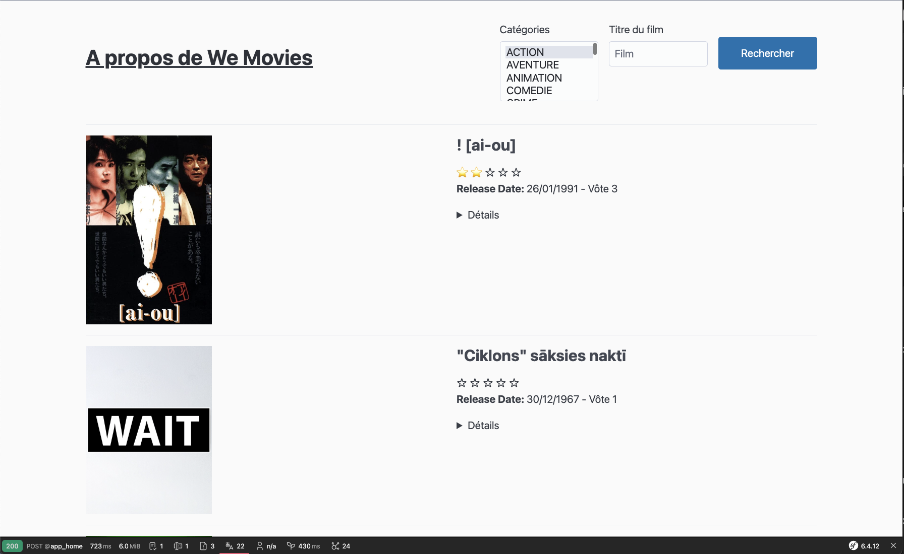

# yellow_consulting


### Requirements
---

- PHP 8.1
- Symfony 6.4 
- Apache 2.4
- MySQL 5.7
- Composer 2

### Usage
---

### Installation
---

```
git clone git@github.com:Jonathanlight/app_yellow_consulting.git
$ cd app_yellow_consulting

application summary please elaborate on how plan to use our API

# Utilisation de Symfony CLI
symfony new --webapp symfony --version=6.4.*

# build docker containers
$ make docker-build

# or start docker containers
$ make docker-run

# run tests and code quality checks
$ make docker-exec
$ vendor/bin/php-cs-fixer --config=.php-cs-fixer.php --verbose fix
$ vendor/bin/phpstan analyse src --level=7
$ vendor/bin/phpunit

# install dependencies
$ make docker-exec apache bash
$ composer install
```

### Installation SSl
---
```
cd docker/etc/apache/ssl/

openssl req -x509 -out server.crt -keyout server.key \
-newkey rsa:2048 -nodes -sha256 \
-subj '/CN=localhost' -extensions EXT -config <( \
printf "[dn]\nCN=localhost\n[req]\ndistinguished_name = dn\n[EXT]\nsubjectAltName=DNS:localhost\nkeyUsage=digitalSignature\nextendedKeyUsage=serverAuth")

```

### Configuration
---

### Deployment
---

### Authors
---

- Jonathan KABLAN

